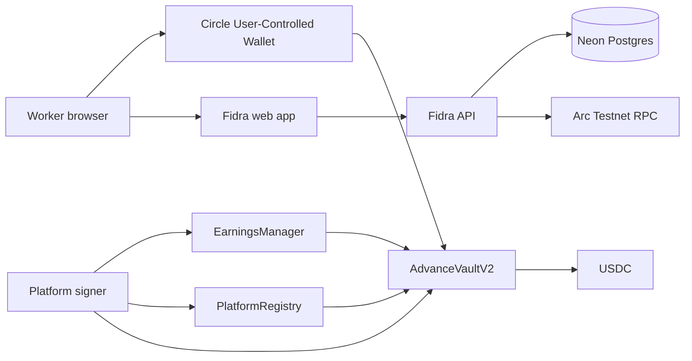

# Fidra

## Get paid when the work is done, not when payday arrives.

**Fidra lets work platforms offer instant USDC payouts for completed work without changing their normal settlement schedule.**

A platform confirms that a worker earned money. Fidra pays the worker immediately. The platform settles with Fidra later, and the worker never owes Fidra.

### [Live Demo → https://fidra-arc.vercel.app/try](https://fidra-arc.vercel.app/try)

The public demo uses Circle User-Controlled Wallets and real transactions on Arc Testnet. It does not require MetaMask, a manually entered wallet address, or terminal intervention. Testnet assets have no real-world value.

| Live service | URL |
|---|---|
| Product | [fidra-arc.vercel.app](https://fidra-arc.vercel.app) |
| Instant-payout demo | [fidra-arc.vercel.app/try](https://fidra-arc.vercel.app/try) |
| API health | [fidra.onrender.com/api/health](https://fidra.onrender.com/api/health) |
| Submission freeze | [`fidra-v1.5-hackathon`](https://github.com/0takuc0mrade/Fidra/tree/fidra-v1.5-hackathon) |

## The problem

Irregular workers often finish a task today and wait days or weeks for the platform's next payout cycle. Large platforms can build custom instant-payout systems, but smaller and global work platforms still need:

- embedded worker wallets;
- upfront USDC liquidity;
- platform credit and reserve controls;
- reliable claim, payout, and settlement accounting; and
- a recovery path that does not turn the advance into worker debt.

Fidra packages those pieces into one embedded payout flow.

## How Fidra works

```text
1. Work is completed
        ↓
2. The platform certifies the worker's earnings
        ↓
3. The worker chooses Get paid now
        ↓
4. Fidra buys the certified claim and sends USDC
        ↓
5. The platform settles on its normal schedule
```

The worker sells a certified earnings claim to Fidra. This is not a worker loan: the platform is responsible for settlement, a completed payout cannot be clawed back after platform default, and the worker never owes the vault.

### Example

| Step | Amount |
|---|---:|
| Platform-certified earnings | `0.100 USDC` |
| Worker receives immediately | `0.099 USDC` |
| Fidra fee | `0.001 USDC` |
| Platform settles later | `0.100 USDC` |
| Platform exposure | `0 → 0.100 → 0 USDC` |

The demo uses small testnet amounts; the protocol uses integer USDC units and configurable per-platform fees and credit limits.

## Worker experience

1. Sign in by email through Circle.
2. Fidra creates or restores a user-controlled Arc Testnet EOA.
3. Complete the demo task and receive certified earnings.
4. Click **Get paid now** and approve the contract interaction in Circle.
5. See independently verified Arc receipts for the payout and automatic platform settlement.

Fidra never receives the worker's private key and never signs the worker's purchase transaction.

## Live proof: hosted claim #8

On August 9, 2026, a completely fresh public browser session completed the full hosted journey without terminal, MetaMask, manual wallet entry, manual claim creation, manual gas funding, or manual settlement.

| Result | Confirmed value |
|---|---|
| Worker | [`0x5e41…Cf8c0`](https://testnet.arcscan.app/address/0x5e41d176C9be58F7b8EB2E7B17B08A8Ce17Cf8c0) |
| Platform | `3` |
| Claim | `#8` — `Settled` |
| Certified earnings | `0.100 USDC` |
| Gross instant payout | `0.099 USDC` |
| Worker transaction gas | `0.01163310519 USDC` |
| Platform settlement | `0.100 USDC` |
| Realized spread | `0.001 USDC` |
| Final platform exposure | `0` |
| Final vault cash | `2.442 USDC` actual and accounted |

### Arc receipts

| Action | Transaction |
|---|---|
| Automatic worker gas seed | [`0x5a2a…1fef`](https://testnet.arcscan.app/tx/0x5a2a960d6c44b8d93375adfe240b0738586c903dd93a81e46722055e4d351fef) |
| Claim creation | [`0x4feb…ee71`](https://testnet.arcscan.app/tx/0x4febbc694100c1a644d7099a950a09a73331cc6ab5c450105e175450929dee71) |
| Claim certification | [`0xa20b…5ab4`](https://testnet.arcscan.app/tx/0xa20b8178d23f0b6303df579ffd3d8a4538248ae69c54b3b74117f64af54c5ab4) |
| Circle-controlled worker advance | [`0x7d16…f9c5`](https://testnet.arcscan.app/tx/0x7d166316f50f08429d991481b00ca8b907234d42ae5d8092515931d3898ef9c5) |
| Platform USDC approval | [`0x977c…a8ef`](https://testnet.arcscan.app/tx/0x977cc6197104af8f78befe87a22c1a4d66c276be7d9b233d79425e584a9aa8ef) |
| Automatic platform settlement | [`0xf7af…50c6`](https://testnet.arcscan.app/tx/0xf7afa70a0da1e0f1e68c0313310b394dd9f1e530d4cd224fdaf4c10c83f450c6) |

Refresh recovery passed after gas funding, certification, and completion. The completed workflow and the same receipts also survived a Render service restart through Neon-backed durable state. No financial action repeated.

The complete secret-safe ledger is [`deployments/arc-testnet/v1.5.3-hosted-end-to-end.json`](deployments/arc-testnet/v1.5.3-hosted-end-to-end.json).

## Architecture



### Product layer

- **Vercel:** responsive worker and platform interface.
- **Render:** Node API for Circle orchestration, validation, automatic sandbox actions, receipt recovery, and rate limits.
- **Neon Postgres:** durable workflows, idempotency keys, budget reservations, seed-once records, and restart recovery.
- **Circle User-Controlled Wallets:** email authentication and worker-approved Arc transactions without exposing worker keys to Fidra.

### Protocol layer

- **PlatformRegistry:** platform settlement wallet, active/paused status, credit limit, purchased-claim exposure, reserve, and advance fee.
- **EarningsManager:** immutable platform-certified worker claims with unique task evidence and bounded batch certification.
- **AdvanceVaultV2:** exact-worker claim purchases, USDC advances, platform settlement, reserve-backed default resolution, and reconciled accounting.

Certification alone creates no vault exposure. Exposure starts only when a worker sells a certified claim to the vault.

## Why Arc

Fidra needs programmable USDC settlement, low-friction testnet execution, and independently verifiable receipts across worker payout, platform settlement, reserves, and vault accounting. Arc provides the EVM execution environment and native USDC-oriented network model used by the complete live flow.

Every reported success is tied to Arc state—not to a UI message or Circle status alone.

## Why Circle

Workers should not need to install MetaMask, manage a seed phrase for a demo, manually enter a wallet address, or understand gas before receiving earnings.

Circle provides:

- email-based authentication;
- user-controlled Arc EOAs;
- an embedded transaction approval window; and
- a clear custody boundary where Fidra never controls the worker's key.

Circle submits the worker's transaction, but Fidra independently verifies the Arc receipt, sender, target contract, claim state, and vault purchase state before reporting success.

## Safety model

### Protocol invariants

- No claim can be advanced before certification.
- Certified claims cannot be edited, cancelled, or revoked.
- The purchasing address must exactly match the claim's worker.
- A claim cannot be purchased or settled twice.
- Workers never owe the vault.
- Platform exposure cannot exceed its configured credit limit.
- Default cannot reduce a completed worker payout.
- Default draws available reserve, pauses the platform, and blocks new advances.
- Paused platforms can still repay existing obligations.
- Actual cash, accounted cash, outstanding principal, and realized results remain explicit and reconcilable.

### Hosted sandbox controls

- `0.10 USDC` claim cap;
- `0.04 USDC` automatic gas seed;
- `0.05 USDC` per-wallet gas maximum;
- one seed per worker wallet;
- `0.20 USDC` daily gas budget;
- `0.50 USDC` global claim budget;
- database-backed rate limits and atomic budget reservations;
- dedicated non-owner platform and gas-funder keys; and
- independent write and gas-seed kill switches.

The kill switch is implemented and passes deterministic fail-closed tests. Its hosted exercise was deferred to keep the public sandbox available for judges.

## How to test Fidra

1. Open [the live `/try` experience](https://fidra-arc.vercel.app/try) in a private browser window.
2. Authenticate by email through Circle.
3. Create or restore the Circle-controlled Arc Testnet wallet.
4. Let Fidra check and, when required, seed bounded transaction gas.
5. Complete the demo task to create and certify `0.10 USDC` of earnings.
6. Review the `0.099 USDC` quote and click **Get paid now**.
7. Approve `purchaseAdvance(claimId)` in Circle.
8. Watch Fidra verify the Arc payout and automatically settle the platform obligation.
9. Open the real ArcScan links in the verified timeline.

The public sandbox is budget-limited. If its write switches are temporarily disabled, the product and historical receipts remain available in read-only mode.

## Contracts and verified deployment

| Contract | Arc Testnet address |
|---|---|
| PlatformRegistry | [`0x20Ec…1af3`](https://testnet.arcscan.app/address/0x20EcB05d90D4F24F8Fcf2785BdE240796B8b1af3) |
| EarningsManager | [`0xdC1C…cD57`](https://testnet.arcscan.app/address/0xdC1C359fC174Fb8C7cDcbE0e09447d123dD9cD57) |
| AdvanceVaultV2 | [`0x1260…49c5`](https://testnet.arcscan.app/address/0x12604e5acD074D3499C9ac4D2cbb4Bd39ECE49c5) |
| Canonical USDC | [`0x3600…0000`](https://testnet.arcscan.app/address/0x3600000000000000000000000000000000000000) |

Additional evidence:

- [V1.1 deployment and default-path ledger](deployments/arc-testnet/v1.1-latest.json)
- [V1 product specification](docs/V1_PRODUCT_SPEC.md)
- [V1 architecture specification](docs/V1_ARCHITECTURE.md)
- [Security invariants](docs/SECURITY_INVARIANTS.md)
- [Public deployment model](docs/PUBLIC_DEPLOYMENT.md)

## Validation

The frozen submission passed:

- Foundry formatting, unit, fuzz, and stateful invariant checks;
- 52 deterministic server tests;
- 8 real Neon persistence/concurrency tests;
- 4 frontend test files and the production build;
- exact-origin CORS and secure cross-site session checks;
- direct `/try` refresh routing;
- refresh and Render restart recovery; and
- repository and evidence secret scans.

Run the local checks with:

```bash
cd contracts
forge fmt --check
forge test

cd ../server
npm test
npm run check

cd ../web
npm test
npm run build
```

Local secrets belong only in ignored `.env` files. Never expose Circle credentials, database URLs, SMTP credentials, session material, or private keys through `VITE_` variables.

## Repository structure

```text
Fidra/
├── contracts/   # V1 protocol and Foundry tests
├── server/      # Circle boundary, sandbox automation, Neon persistence
├── web/         # Worker, platform, and /try interfaces
├── shared/      # Exported ABIs and schemas
├── deployments/ # Confirmed public Arc Testnet evidence
└── docs/        # Product, architecture, security, and runbooks
```

## Scope

Fidra V1 intentionally does not add CCTP, Gateway, Paymaster, USYC, cross-chain settlement, LP shares, or production credit scoring. This milestone proves one focused product loop: certified work becomes an immediate, worker-controlled USDC payout and the platform settles later.

The system is deployed on Arc Testnet for demonstration and is not represented as production-ready financial infrastructure.

## Legacy V0

Fidra originally explored vendor purchase-receivable financing. The V0 `MandateManager` and `AdvanceVault` contracts remain unchanged as historical evidence and are isolated from V1.

| Legacy contract | Address |
|---|---|
| MandateManager | [`0xEfA2…9EF2`](https://testnet.arcscan.app/address/0xEfA2b3e70138810eA51552177c3f1AE5ab249EF2) |
| AdvanceVault | [`0x5F7B…8C8B`](https://testnet.arcscan.app/address/0x5F7Bec9eC341F816182a56D8E033cac63DBd8C8B) |

V1 does not import, upgrade, modify, or redeploy those contracts.
